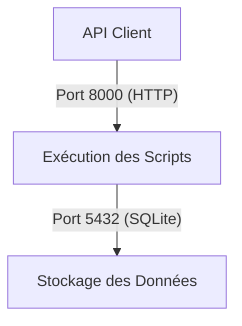

# Sales brief simplon
## Description
Ce projet à été fait dans un but de test de sélection. L'objectif était de réaliser un traitement et une analyse de données à partir d'un brief client. Il va :
- Créer la base de données et les tables (`create_database.py`)
- Importer les données (`import_data.py`)
- Effectuer des analyses sur les ventes (`analyse_data.py`)
## Architecture du projet
L’application est composée de 2 services principaux :

## Le service d'exécution des scripts et le service de stockage de données

| **Service**          | **Objectif** |
|----------------------|--------------------------------------------------------------|
| **Execution_Scripts** | Exécute les scripts Python (`entrypoint.sh`, `create_database.py`) |
| **Stockage_Donnees**  | Contient la base SQLite (`analyse_des_ventes.db`) |
 

## Les entrées et sorties de communication entre les services

| Source              | Destination         | Port        | Sens de communication   |
|---------------------|--------------------|------------|------------------------|
| **Execution_Scripts** | **Stockage_Donnees** | `5432` (SQLite) | Écriture/Lecture |
| **Client API**      | **Execution_Scripts** | `8000` (HTTP) | Requête REST |

## Le schéma est le suivant :

## Installation 
- **Python 3.9+** doit être installé
- **Docker & Docker Compose** configurés sur la machine
- **SQLite** pour gérer la base de données (le package SQLite est fourni avec python)
  Une fois fait, vous pouvez
  Cloner le dépôt et configurer l’environnement :
```bash
git clone (https://github.com/thomas-demagny/sales_brief_simplon.git)
cd sales_brief_simplon
```
Puis executer :
  ``` bash
  docker-compose up --build
  ```
Docker va lancer les scripts automatiquement dans l'ordre suivant : 
``` bash
1️ - Création de la base de données et des tables 
2 - Importation des données 
3️ - Analyse des ventes 
4️ - Arrêt automatique du conteneur après l’exécution complète
```
